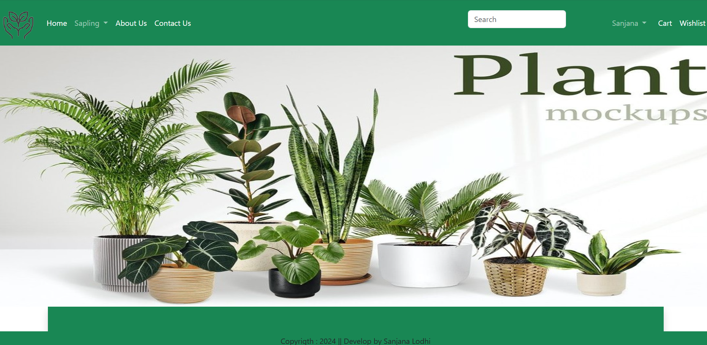
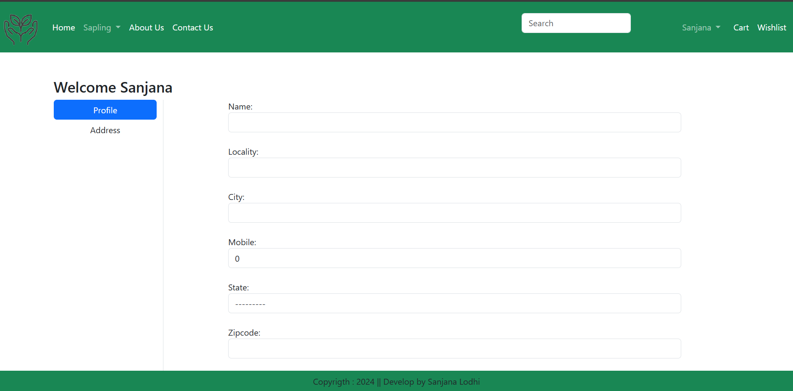
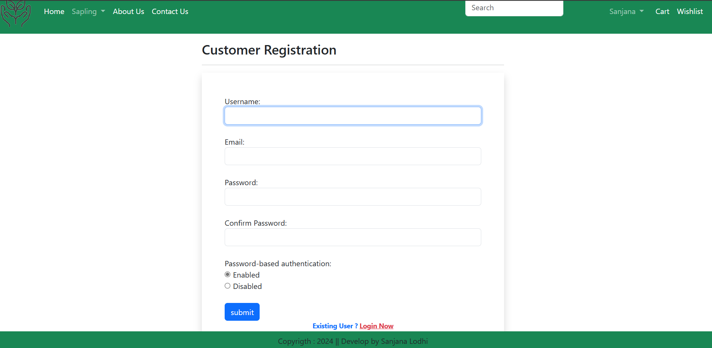
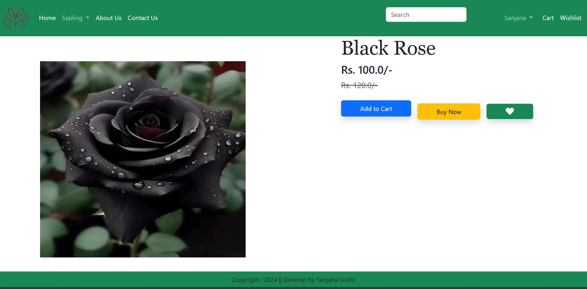
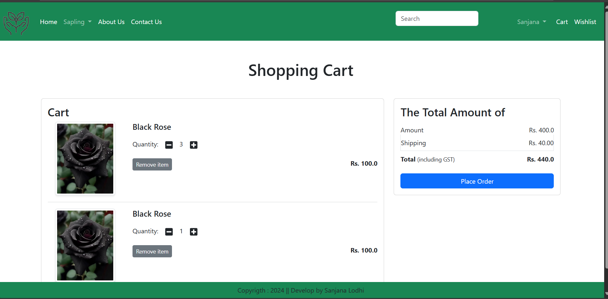

# GreenLeaf Nursery - Plant Selling Website

## 🌱 Project Overview
GreenLeaf Nursery is an online platform for buying and selling nursery plants. Customers can browse a variety of plants, add them to the cart, and complete purchases securely.

## ✨ Features
- **User Authentication**: Register, login, and manage accounts.
- **Plant Listings**: Display various plants with images, descriptions, and prices.
- **Shopping Cart**: Add and remove items before checkout.
- **Order Management**: Track orders and purchase history.
- **Admin Panel**: Manage products, users, and orders.

## 🔧 Requirements

### Software Requirements
- **Operating System**: The project can run on Windows, macOS, or Linux.
- **Python Version**: Python 3.7 or higher is required for running the project. Python 3.8 or later is preferred for compatibility with modern libraries.
- **Web Frameworks**: The project relies on Django for backend development, handling API routes, managing user sessions, and processing transactions.
- **Libraries**: Key libraries include Django for web development, SQLite for database management, and Pillow for handling images.

### Hardware Requirements
- **Processor (CPU)**: A modern multi-core processor, such as Intel Core i5 or equivalent, is required. A more powerful processor, like Intel Core i7, can improve performance.
- **Memory (RAM)**: A minimum of 8GB of RAM is recommended for smooth operation.
- **Internet Connectivity**: A stable internet connection is essential for hosting and accessing the website.

## 🚀 Installation
Follow these steps to set up the project on your local machine:

1. **Clone the repository**:
   ```bash
   git clone <repository-url>
   cd GreenLeaf_Nursery
   ```
2. **Create a virtual environment** (optional but recommended):
   ```bash
   python -m venv env
   source env/bin/activate  # On Windows: env\Scripts\activate
   ```
3. **Install dependencies**:
   ```bash
   pip install -r requirements.txt
   ```
4. **Apply migrations**:
   ```bash
   python manage.py migrate
   ```
5. **Run the server**:
   ```bash
   python manage.py runserver
   ```
6. Open `http://127.0.0.1:8000/` in your browser.

## 🛠 Technologies Used
- **Backend**: Django, SQLite
- **Frontend**: HTML, CSS, JavaScript
- **Authentication**: Django Auth
- **Hosting**: (Add if applicable)

## 📌 Future Enhancements
- Add payment gateway integration
- Implement customer reviews & ratings
- Improve UI/UX with responsive design

## 📸 Website Screenshots
### 1. Home Page

### 2. Profile Page

### 3. Login/Registration

### 4. Product Listing

### 5. Checkout & Orders


## 🤝 Contributing
Feel free to fork this repository, make changes, and submit a pull request!


